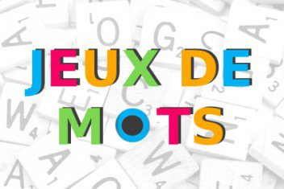

<h1 align="center">
  
</h1>

---

# JEUX DE MOT

## Petit résumé
- Quel meilleur moyen d'apprendre le scrabble que de retrouver des mots qu'avec ses lettres mélangées.

## Objectifs
- Trouver le mot initial par rapport à ses lettres mélanger avec cinq chances par mot.

## Techno
- VB.Net
- Visual Studio

## UI

## Auteur
- [@Pierre](https://github.com/Pierre-Portfolio)
